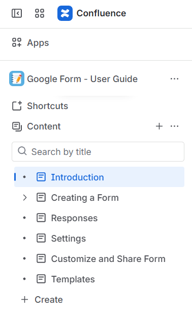

# Google-Forms---User-Guide(Confluence Project)  
This project showcases a **User Guide for Google Forms** created using **Confluence**.  
The guide includes multiple structured pages with step-by-step instructions, visuals, and formatting for clear understanding.  

## Project Overview
- Designed a multi-page **User Guide** in Confluence.    
- Covered topics like:  
  - Introduction to Google Forms    
  - Creating and Customizing Forms    
  - Adding Questions and Themes    
  - Sharing and Settings    
- Organized pages with hierarchy and linked navigation for easy use.

## Tools Used
- **Confluence** – for creating structured documentation    
- **Markdown** – for formatting and headings    
- **GitHub** – to host screenshots and showcase work

## Screenshots
Below are some screenshots from the Confluence user guide:   

  
  
